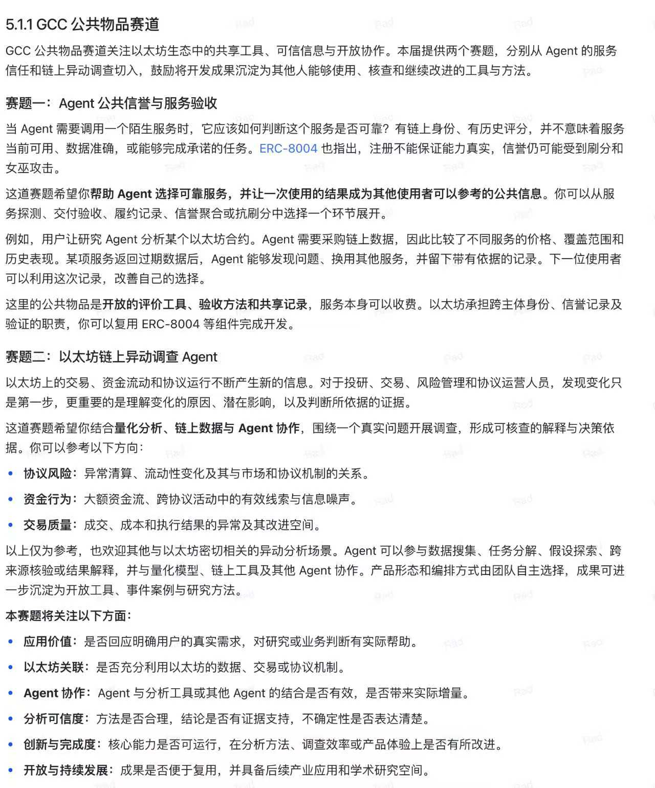
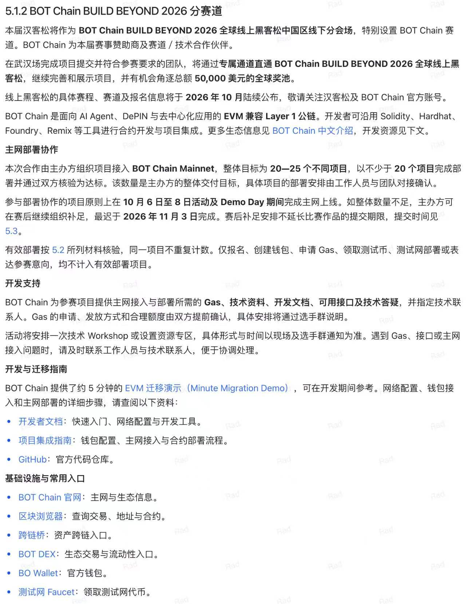

# ETH 与赛事赛道

## Ethereum 与 ETH

Ethereum（以太坊）是支持智能合约与应用的区块链网络；ETH 是其原生资产，用于网络费用等用途。赛事名称中的 ETH 通常指向以太坊开发者生态，不能理解为所有项目都必须设计代币或做交易产品。[Ethereum 官方介绍](https://ethereum.org/what-is-ethereum/)

本次选题可从开放协作、可核验规则、减少对单一中介的依赖、成果可复用等角度理解以太坊生态的设计取向。这些理念不等于全部比赛的固定评分标准；本届具体判断以下面的赛题截图为依据。

## GCC 公共物品赛道

原始规则来自参赛者提供的截图：

### 题目一：Agent 公共信誉与服务验收

帮助 Agent 选择可靠服务，并让一次使用的结果成为其他使用者可以参考的公共信息。可从服务探测、交付验收、履约记录、信誉聚合或反刷分入手。链上身份及历史评分不能证明服务此刻可用或能力真实。

公共物品是开放评价工具、验收方法和共享记录，服务本身可以收费。以太坊承担身份、信誉记录及验证职责，可复用 ERC-8004 等组件。

### 题目二：以太坊链上异动调查 Agent

围绕真实问题，将量化分析、链上数据与 Agent 协作结合，形成可核查的解释和决策依据。参考方向包括协议风险、资金行为及交易质量。Agent 可参与搜集、任务分解、假设探索、跨源核验与解释。

截图列出的关注点包括应用价值、以太坊关联、Agent 协作、分析可信度、创新与完成度，以及开放与持续发展。仅有报警、聊天报告或链上哈希不足以证明这些要求已经满足。

## BOT Chain BUILD BEYOND 2026 分赛道

原始规则来自参赛者提供的截图：

截图将 BOT Chain 描述为面向 AI Agent、DePIN 与去中心化应用的 EVM 兼容 Layer 1，可沿用 Solidity、Hardhat、Foundry 和 Remix 等工具。

需要特别区分：

- 主网部署协作的 20—25 个项目是主办方整体目标，不是每支团队要求。
- 报名、创建钱包、申请 Gas、领取测试币、仅在测试网部署或表达意向，不计入有效主网部署。
- 截图原则上要求在 10 月 6—8 日活动与 Demo Day 期间完成上线。赛后补足安排不延长比赛作品提交期限。
- 50,000 美元属于全球线上赛事奖池，不能直接当作武汉场奖金。
- Gas、技术资料、接口与答疑由赛道支持安排提供，具体额度和接入需对接。

截图引用了完整规则 5.2 的核验材料及 5.3 的提交时间，但这两节未随本次图片提供。不得凭本文推断具体核验清单或延长提交期限。

## 如何融合原始案例

| 原始案例中的机制 | GCC 可借鉴点 | BOT 可借鉴点 |
| --- | --- | --- |
| CarryPilot 的确定性计算与风险检查 | 可复算验收、证据与拒绝理由 | 任务兼容及净收益检查 |
| Huozi 的 Agent 服务采购 | 选择与评价服务的真实场景 | 服务调用与收入分配 |
| Makebook 的报价冻结、需求承诺与清算 | 开放研究案例中的规则核对 | 多买家资金承诺、统一清算与退款 |
| PolyAgentMarket 的任务组织 | 调查任务拆分与协作 | 多服务执行组织，须避免重复通用市场 |
| FactMatch 的承诺金规则 | 分析规则是否公平及证据充分 | 借鉴资金状态，不能用承诺金证明履约 |

原始项目的网络、部署及测试情况详见 HTML 报告。本次设计以案例机制为模板，并不把案例迁移到新链本身视为创新。
